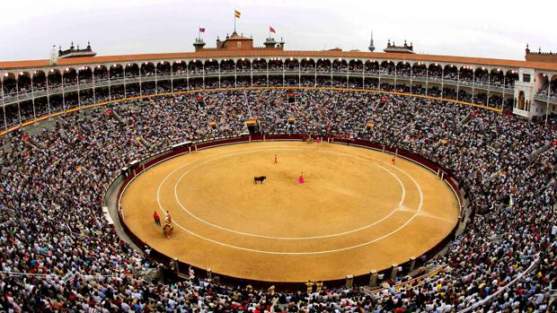
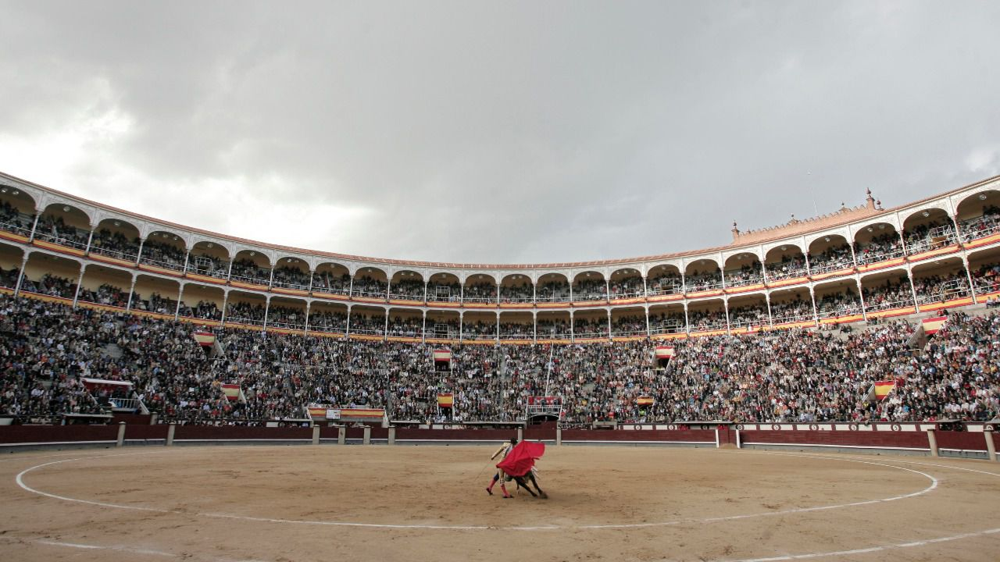
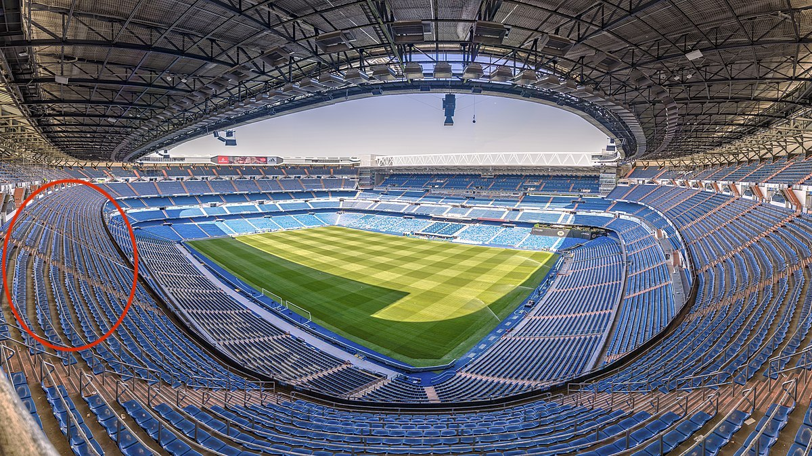
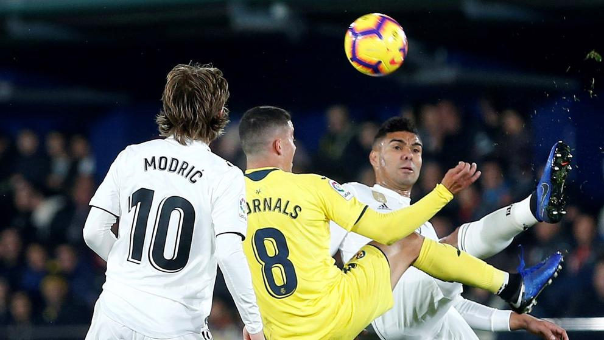
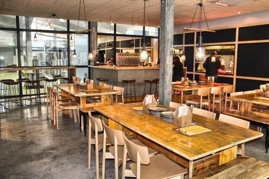
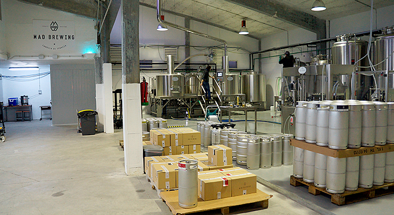

<script> 
    $(document).ready(function() { 
    $head = $('#header'); 
    $head.prepend('<A href = https://www.cuttingedge-events.com></A>') 
    }); 
</script> 


```{r setup, include=FALSE}
knitr::opts_chunk$set(echo = FALSE, message=FALSE, warning=FALSE)
```


```{r libraries}
library(readxl)
library(dplyr)
library(knitr)
library(timevis)

```

## Accommodation

### Mail Hotel: Catalonia Gran Via

<iframe src="CataloniaGranVia/CataloniaGranVia.html" frameborder="0" width="100%" height="1000" scrolling="no"></iframe>

### Alternative Hotels {.tabset .tabset-fade .tabset-pills}

#### Eurostars Plaza Mayor

<iframe src="Eurostars Plaza Mayor/Eurostars.html" frameborder="0" width="100%" height="1060" scrolling="no"></iframe>

<iframe width="100%" height="450" src="https://www.youtube.com/embed/kD7-a2Vkk6w" frameborder="0" allow="accelerometer; autoplay; encrypted-media; gyroscope; picture-in-picture" allowfullscreen></iframe>

#### Meliá Castilla

<iframe src="Melia Castilla/Melia.html" frameborder="0" width="100%" height="1470" scrolling="no"></iframe>

## Programme


<iframe src='https://cdn.knightlab.com/libs/timeline3/latest/embed/index.html?source=1OQ5NOG6XeX7unWI1Aq312sNo4KasqQdhEPOigfCfR6A&font=Default&lang=en&initial_zoom=2&height=450' width='100%' height='450' webkitallowfullscreen mozallowfullscreen allowfullscreen frameborder='0'></iframe>

### DAY 1 - May 16th, 2020

Calculating the arrival time by 16:00, a member of Cutting Edge Events staff will be at the airport for a meet and greet with the group. Our staff member will scort the group to the bus, that will be located in the bus parking. 
After this, the group will go directly to the hotel for a quick check in. 

The check in will take about 20 minutes, after this, we will meet in the lobby to go to Las Ventas bullring. 

**Activity - Toros Las Ventas** 

As told, we will meet the group at 18.00 at the lobby. A bus will be waiting outside for a disposal during the activity. 
During these dates, Madrid will be celebrating la "feria de San Isidro", a local fair destined to the bullfights in the city. 
The bullfight will be at 19.00, so group should be there 30 minutes before. 

Each show has different bullfights, that takes about 20 minutes each. 

* **Location** Las Ventas. 
* **Duration** 1 h 30' aprox.  
* **Included** Bus, ticket entrance and english speaking asssistance.






**Dinner **

Once the show has finished, the bus will take the group back to the hotel again for the dinner. The dinner will take place at La Mucca del Prado, a restaurant located really close to the hotel, only 9 minutes by walking. 

<iframe src="LaMuccadePrado/LaMuccadePrado.html" frameborder="0" width="100%" height="1100" scrolling="no"></iframe>

### DAY 2 - May 17th, 2020

During the morning, guests will enjoy their free time. Time for shopping or walking around Madrid.

We will meet in the lobby of the hotel at 13:00 or if guests go for a walk at the city centre we meet directly in the restaurant for lunch. The restaurant will be "Los Galayos", a restaurant located 10 minutes by walking from the hotel, based in Mediterranean cuisine

<iframe src="Los Galayos/Galayos.html" frameborder="0" width="100%" height="1100" scrolling="no"></iframe>


<iframe src="https://www.losgalayos.net/visitas3d/salon-duque" frameborder="0" width="100%" height="480" scrolling="no"></iframe>

**Activity - Real Madrid - Villareal** 

After the lunch, group will go back to the hotel and they'll have the possibility to rest for a while before going to Santiago Bernabeu to watch Real Madrid's game. 

Fuguring out that the game starts at 18:00, we will meet in the lobby at 16:00 to go to the stadium by bus. The stadium is located at Paseo de la Castellana, 15 minutes by bus from the hotel, but we have to take in a count that it turns into a really busy street when a football match and it can take long to reach the stadium. 

*The Club can't guarantee that all 40 people will be sitted together*

Once we arrive, our english speaking assistance will guide guests to the stadium and their door entrance.

* **Location** Paseo de la Castellana. 
* **Duration** 2 hours aprox.  
* **Included** Bus, ticket entrance and english speaking asssistance.



*This will be the zone where clients will be located. As told, the Club can't guarantee that all 40 people will be sitted together.*



**Dinner **

Once the game has finished, our english speaking assistance will meet with the group outside the stadium to pick them up and scort them to the bus. 

The bus will take the group directly to the restaurant where they will have the dinner,  restaurant "Ana La Santa". The restaurant is only 10 minutes by walk from the hotel. 

<iframe src="AnaLaSanta/AnaLaSanta.html" frameborder="0" width="100%" height="1100" scrolling="no"></iframe>


### DAY 3 - May 18th, 2020

Madrid had always a large tradition with beer, so thats why there are many craft breweries. 
On this morning we will visit a local and craft brewerie, *Mad Brewing*. We will have a bus at dispoal for the activity and after for a transfer to the airport. Guests will load the lugagge in the bus as we will go directly from the brewery to the airport. 

This is a traditional brewery located in the San Blas neighbourhood, which is a little off the beaten track from the city centre but is well worth a visit to try one of its beers, savour a delicious meal or tour its facilities.

Mad Brewing encompasses three different concepts in one space: it is a brewery, bar and a restaurant all in one. The establishment, decorated in a modern New York style, uses long tables and a perfect culinary proposal to wash down with a beer. 
Guests will enjoy of a visit into the brewery with a beer tasting. Finally, they will have the lunch there as there is a restaurant inside. 

* **Location** San Blas district. 
* **Duration** 4 hours aprox.  
* **Included** Bus at disposal, visit the brewery, beer tasting and lunch.





When guests has finished with the lunch, they will go to the airport directly by bus. 


END OF THE PROGRAM

*****

## Budget

<iframe src="madridbudget.html"  frameborder="0" width="100%" height="1600" scrolling="no"></iframe>

<br>

## Terms & Conditions

  * Restaurant rates are valid for 2019, they can suffer small changes.
  
  * Football and Bullfight dates are estimated, the final dates and hours will be published 15 days prior the event.
  
  * Net rates for Metatours
  
  * Rates valid for a group of 40 pax
  
  * Cutting Edge Events management fee including in the detailed rates
  
  * VAT included. 
  
  * No reservation has been done. Availability upon request.

## Amaze your clients!!

<div class="client_offer">

<p>Didn't you just love our presentation ? Our first goal here at _**Cutting Edge Events**_ is to help you **win** this business. You will most likely now collate the information contained in this website and make your own presentation
to show your client<br>

<p>Why not leverage our technology, and present your client with the same format ? As a **totally free service**, we offer you the possibility of doing the work for you</p>

<p> We will: 
  <ul>
    * Follow your instructions to add anything you want to be in your presentation, and delete anything that you don't consider relevant
    * Include your logo and company details, and remove all our company details
    * We can even change some colors to mimic your corporate identity
    * We will send you the new link, and it will look as if it was your work
  </ul>
</p>
</div>

<style>

.client_offer{
background-color: #ee7600;
color: white;
padding: 10px;
border: 1px solid black;
margin-left: 25px;
margin-right: 25pax;
border-radius: 5px;
font-style: italic;
}
</style>

******************


